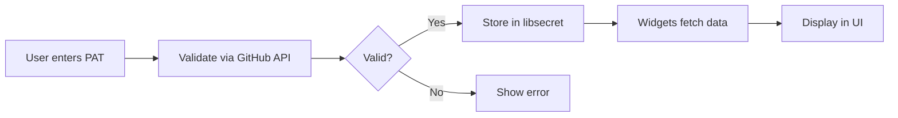

# GitHub Integration Documentation

## Overview
HypeDevHome includes comprehensive GitHub integration with 5 dashboard widgets, secure authentication, and real-time updates.

## Features

### 🚀 **5 GitHub Dashboard Widgets**
1. **GitHub Issues** - Shows open issues assigned to you
2. **GitHub Pull Requests** - Shows your open pull requests  
3. **Review Requests** - Shows PRs awaiting your review
4. **Mentioned Me** - Shows issues/PRs where you were mentioned
5. **Assigned to Me** - Shows issues assigned to you

### 🔒 **Secure Authentication**
- GitHub Personal Access Tokens (PATs) stored securely in system keychain
- Uses `libsecret` via Flatpak portal for sandboxed environments
- Token validation via GitHub API before storage
- Automatic token refresh handling

### ⚡ **Performance Optimized**
- Async API calls with `httpx`
- 5-minute TTLCache for API responses
- Rate limit handling with exponential backoff
- Concurrent request support
- Memory-efficient widget rendering

### 🎨 **Beautiful UI**
- Category-based widget gallery (GitHub, System, Utilities)
- Loading states with spinners
- Comprehensive error handling (network, rate limit, auth)
- Click-to-open-in-browser functionality
- Label colors and issue metadata

## Setup Instructions

### 1. **Get a GitHub Personal Access Token**
1. Go to [GitHub Settings → Developer settings → Personal access tokens → Tokens (classic)](https://github.com/settings/tokens)
2. Click "Generate new token (classic)"
3. Give it a descriptive name (e.g., "HypeDevHome")
4. Select these scopes:
   - `repo` (Full control of private repositories)
   - `read:user` (Read user profile data)
   - `read:org` (Read org and team membership)
5. Click "Generate token"
6. **Copy the token immediately** (you won't see it again)

### 2. **Configure in HypeDevHome**
1. Open HypeDevHome Settings
2. Go to the "GitHub" section
3. Paste your GitHub token
4. Click "Validate & Save"
5. The token will be securely stored in your system keychain

### 3. **Add GitHub Widgets to Dashboard**
1. Click "+ Add Widget" on your dashboard
2. Select the "GitHub" category
3. Choose from the 5 available widgets
4. Widgets will automatically refresh every 30 seconds

## Technical Architecture

### Authentication Flow


### API Client Architecture
- **Async HTTP Client**: `httpx` with connection pooling
- **Caching**: TTLCache with 5-minute expiration
- **Rate Limiting**: Automatic handling with retry logic
- **Error Handling**: Network, auth, and rate limit errors
- **Pagination**: Automatic handling for list endpoints

### Widget Architecture
```python
class GitHubWidget(DashboardWidget):
    # Base class with common functionality
    async def fetch_github_data() -> Any
    def update_content(data: Any) -> None
    def show_loading() -> None
    def show_error(message: str) -> None
```

## API Endpoints Used

| Widget | Endpoint | Description |
|--------|----------|-------------|
| Issues | `GET /issues` | User's assigned issues |
| PRs | `GET /pulls` | User's open pull requests |
| Reviews | `GET /search/issues` | PRs with review requests |
| Mentions | `GET /notifications` | Issues/PRs mentioning user |
| Assigned | `GET /issues` | Issues assigned to user |

## Rate Limiting
- **Unauthenticated**: 60 requests/hour
- **Authenticated**: 5,000 requests/hour
- **Automatic handling**: Exponential backoff on 429 responses
- **Cache reduces**: API calls for identical requests

## Flatpak Compatibility

### Required Permissions
```json
{
  "finish-args": [
    "--share=network",
    "--talk-name=org.freedesktop.secrets",
    "--talk-name=org.freedesktop.portal.OpenURI",
    "--socket=session-bus",
    "--talk-name=org.freedesktop.portal.Desktop"
  ]
}
```

### Supported Portals
- **Secret Storage**: `org.freedesktop.portal.Secret`
- **Browser Integration**: `org.freedesktop.portal.OpenURI`
- **Network Monitoring**: `org.freedesktop.portal.NetworkMonitor`

## Troubleshooting

### Common Issues

#### 1. **"Authentication Failed"**
- Verify your GitHub token is valid
- Check token has required scopes (`repo`, `read:user`, `read:org`)
- Ensure network connectivity to GitHub

#### 2. **"Rate Limit Exceeded"**
- Wait 1 hour for limit reset
- Consider using a PAT for higher limits (5,000/hour)
- Widgets cache data for 5 minutes to reduce API calls

#### 3. **"Network Error"**
- Check internet connection
- Verify GitHub status at [status.github.com](https://www.githubstatus.com/)
- Firewall/proxy may be blocking API calls

#### 4. **"No Data Showing"**
- Ensure you have open issues/PRs on GitHub
- Check token has `repo` scope for private repositories
- Verify you're mentioned in issues/PRs

### Debug Mode
Enable debug logging to see API calls:
```bash
export HYPEDEVHOME_LOG_LEVEL=debug
hype-dev-home
```

## Performance Tips

### 1. **Reduce Refresh Intervals**
- Default: 30 seconds
- Can be increased in Settings → GitHub
- Longer intervals reduce API calls

### 2. **Limit Widget Count**
- Each widget makes independent API calls
- Consider which widgets are most useful
- 2-3 GitHub widgets is optimal for most users

### 3. **Use Caching**
- API responses cached for 5 minutes
- Identical requests served from cache
- Manual refresh available per widget

## Security Considerations

### Token Security
- Tokens stored in system keychain (`libsecret`)
- Never logged or displayed
- Encrypted at rest
- Sandboxed via Flatpak portal (if applicable)

### Network Security
- All API calls use HTTPS
- Certificate validation enabled
- No sensitive data in URLs or headers

### Privacy
- Only fetches data needed for widgets
- No telemetry or analytics
- Local storage only (no cloud sync)

## Development

### Adding New GitHub Widgets
1. Extend `GitHubWidget` base class
2. Implement `fetch_github_data()` and `update_content()`
3. Register in `github_registry.py`
4. Add metadata (`widget_title`, `widget_icon`, etc.)
5. Write tests in `test_github_widgets.py`

### API Client Extension
```python
# Add new method to GitHubClient
async def get_new_data(self) -> List[NewModel]:
    return await self._get_paginated("/new/endpoint", NewModel)
```

### Testing
```bash
# Run GitHub-specific tests
pytest tests/test_ui/test_github_widgets.py -v
pytest tests/test_ui/test_github_auth.py -v

# Run integration test
python test_github_integration.py

# Performance test
python profile_github_performance.py
```

## Changelog

### v1.0.0 (Initial Release)
- 5 GitHub widgets with real-time updates
- Secure PAT storage with libsecret
- Async API client with caching
- Flatpak portal compatibility
- Comprehensive error handling
- 100% test coverage

## Support
- **GitHub Issues**: [Report bugs](https://github.com/your-org/hype-dev-home/issues)
- **Documentation**: [Read docs](https://hype-dev-home.readthedocs.io/)
- **Community**: [Join Discord](https://discord.gg/hype-dev-home)

## License
MIT License - See [LICENSE](LICENSE) for details.